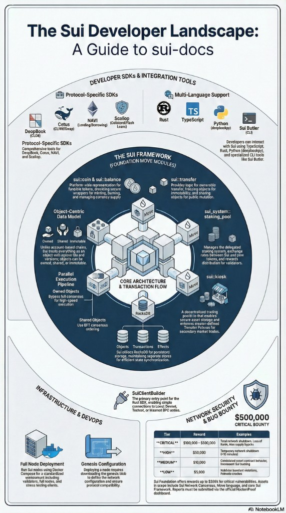

# Sui Docs

A comprehensive developer documentation and verification suite for the Sui blockchain ecosystem. This repository contains manuals, examples, and scripts for interacting with core infrastructure and major DeFi protocols.


## **Project Structure**

The repository is organized into several key areas to support full-stack DeFi development on Sui:

- `/manual`: Detailed guides on protocol concepts, Move programming, and SDK usage.
- `/examples`: Code snippets and implementation examples for various Sui projects.
- `/scripts`: Bash and curl-based verification scripts for testing network health and protocol functionality.
- `/config`: Configuration templates and environment settings.



## **Quick Start**

### **Verify Network Health**
Run the core verification script to check network connectivity and CLI status:
```bash
./scripts/verify-sui-core.sh
```

### **Advanced Examples**
Check the `/examples` directory for atomic cross-protocol integrations:
- [Atomic Swap & Deposit](./examples/ptb-swap-and-deposit.ts)
- [Flash Loan Arbitrage (Advanced)](./examples/ptb-flash-loan-arbitrage.ts)

### **Network Configuration**
Common protocol Object IDs are available in [config/network.json](./config/network.json).

## **Ecosystem Coverage**

### **Phase 1: Core Infrastructure**
- [x] Sui Protocol & CLI
- [x] Move Programming Language
- [x] Fastcrypto & Signatures

### **Phase 2: Major DeFi Protocols**
- [x] Scallop (Lending)
- [x] Navi (Lending)
- [x] Cetus (CLMM DEX)
- [x] SeaProtocol (DEX Aggregator)
- [x] Legato Finance (Prediction Markets)

### **Phase 3: Tools and Specialized SDKs**
- [x] Deepbookpy
- [x] Sui Butler (MCP/CLI)
- [x] Sui DeFi Vault

### **Phase 4: Community Projects**
- [x] Memetic-LaunchPad
- [x] Cetus Volume Booster
- [x] GemWallet
